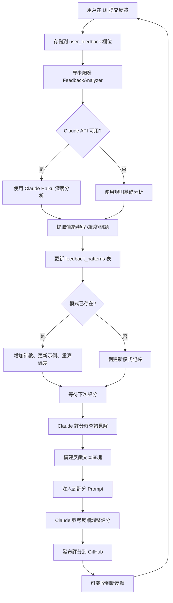

# 🎓 反饋學習循環系統 - 實現文檔

## 📋 概述

本系統實現了一個完整的**用戶反饋學習循環**，使 Claude 能夠從用戶反饋中自動學習並持續改進評分質量。

## ✅ 已實現功能

### 1. 數據庫架構擴展

#### 新增表：`feedback_patterns`
存儲識別出的反饋模式和學習見解

| 欄位 | 類型 | 說明 |
|------|------|------|
| pattern_id | TEXT | 主鍵，格式：`{feedback_type}:{dimension}` |
| pattern_type | TEXT | 反饋類型（too_harsh, too_lenient, missed_issue等） |
| dimension | TEXT | 涉及的評分維度（format, content, clarity, actionability） |
| feedback_theme | TEXT | 反饋主題描述 |
| occurrence_count | INTEGER | 出現次數 |
| avg_score_deviation | REAL | 平均分數偏差 |
| example_feedbacks | TEXT (JSON) | 示例反饋（最多5條） |
| identified_issue | TEXT | 識別出的問題 |
| suggested_adjustment | TEXT | 建議的調整 |
| last_seen | TEXT | 最後一次出現時間 |
| created_at | TEXT | 創建時間 |
| updated_at | TEXT | 更新時間 |

**文件位置**: `src/database.py:262-290`

#### 新增表：`feedback_snapshots`
定期存儲反饋分析的聚合結果

| 欄位 | 類型 | 說明 |
|------|------|------|
| snapshot_id | TEXT | 主鍵 |
| snapshot_date | TEXT | 快照日期 |
| total_feedbacks | INTEGER | 總反饋數 |
| positive_count | INTEGER | 正面反饋數 |
| negative_count | INTEGER | 負面反饋數 |
| neutral_count | INTEGER | 中性反饋數 |
| top_issues | TEXT (JSON) | 主要問題列表 |
| learning_insights | TEXT (JSON) | 學習見解 |
| prompt_adjustments | TEXT (JSON) | Prompt 調整建議 |
| created_at | TEXT | 創建時間 |

**文件位置**: `src/database.py:291-310`

---

### 2. 反饋分析器服務 (`FeedbackAnalyzer`)

**文件**: `src/feedback_analyzer.py`

#### 核心功能

##### A. 智能反饋分析
- **使用 Claude Haiku** 深度分析用戶反饋
- 提取以下信息：
  - 情緒（positive/negative/neutral）
  - 反饋類型（too_harsh/too_lenient/missed_issue等）
  - 涉及的評分維度
  - 具體問題描述
  - 建議的分數調整
  - 關鍵學習點

**方法**: `analyze_feedback_text()` (第 74-151 行)

##### B. 規則基礎分析（備用）
- 當 Claude API 不可用時，使用關鍵詞匹配
- 預定義 8 種反饋模式，每種包含中英文關鍵詞

**方法**: `_rule_based_analysis()` (第 153-214 行)

##### C. 反饋模式追蹤
- 自動識別重複出現的反饋模式
- 計算平均分數偏差
- 聚合示例反饋

**方法**: `_update_feedback_pattern()` (第 248-318 行)

##### D. 學習見解生成
- 查詢高頻反饋模式（可配置閾值）
- 生成維度特定的調整建議
- 提供通用改進指導

**方法**: `get_feedback_insights()` (第 320-391 行)

**返回示例**:
```python
{
    'has_insights': True,
    'summary': '最近 30 天收到 45 條用戶反饋',
    'top_issues': [
        '用戶認為評分過於嚴格 (出現 12 次)',
        '遺漏了某些問題 (出現 8 次)'
    ],
    'dimension_adjustments': {
        'format': [{
            'issue': '格式評分過於嚴格',
            'suggestion': '考慮適度放寬標準',
            'avg_deviation': 8.5  # 用戶認為平均應高 8.5 分
        }]
    },
    'general_guidance': [
        '⚠️ 用戶反映format評分過於嚴格，考慮適度放寬標準',
        '⚠️ 用戶指出遺漏了某些問題，加強該方面的檢查'
    ]
}
```

##### E. 反饋快照
- 定期創建反饋分析快照
- 追蹤改進趨勢
- 支持歷史對比

**方法**: `create_feedback_snapshot()` (第 393-470 行)

---

### 3. Prompt 自動增強

**文件**: `src/issue_scorer_service.py:205-241`

#### 實現邏輯

每次 Claude 評分時，系統會：

1. **獲取最近 30 天的反饋見解**
   ```python
   feedback_insights = self.feedback_analyzer.get_feedback_insights(days=30, min_occurrences=2)
   ```

2. **構建反饋文本區塊**
   - 包含反饋總結
   - 列出用戶反映的重點問題
   - 顯示各維度的具體調整建議（含分數偏差）

3. **注入到所有評分 Prompt**
   - Bug Report (第 267 行)
   - Task (第 347 行)
   - Feature Request (第 388 行)
   - Test Result (第 428 行)
   - Comment (第 487 行)

#### Prompt 示例

```markdown
## 🎓 用戶反饋學習見解

最近 30 天收到 45 條用戶反饋

**最近用戶反饋的重點改進方向**:
⚠️ 用戶反映format評分過於嚴格，考慮適度放寬標準
⚠️ 用戶反映content評分過於寬鬆，考慮提高要求

**各維度評分調整建議**:
- **format維度**: 考慮適度放寬標準 (用戶認為評分平均低了 9 分)
- **content維度**: 提高評分要求 (用戶認為評分平均高了 12 分)

💡 **請根據以上反饋調整評分策略**，確保評分更符合用戶期望和實際情況。
```

---

### 4. 自動反饋處理

**文件**: `src/issue_scorer_service.py:986-1020`

#### 工作流程

當用戶提交反饋時：

1. **存儲反饋到資料庫**
   ```python
   service.db.update_score_record(score_id, {'user_feedback': feedback})
   ```

2. **異步觸發分析**
   ```python
   threading.Thread(
       target=service.feedback_analyzer.process_new_feedback,
       args=(score_id, feedback),
       daemon=True
   ).start()
   ```

3. **Claude 分析反饋內容**
   - 使用 Claude Haiku 模型
   - 提取情緒、類型、維度、具體問題

4. **更新模式資料庫**
   - 如果模式已存在 → 增加計數、更新示例
   - 如果是新模式 → 創建記錄

5. **下次評分時自動應用**
   - 見解注入到 Prompt
   - Claude 參考反饋調整評分策略

---

### 5. API 端點

**文件**: `src/issue_scorer_service.py:1075-1172`

#### 已實現的 API

| 端點 | 方法 | 功能 | 參數 |
|------|------|------|------|
| `/api/feedback/statistics` | GET | 獲取反饋統計數據 | `days` (預設30) |
| `/api/feedback/insights` | GET | 獲取學習見解 | `days`, `min_occurrences` |
| `/api/feedback/snapshot` | POST | 手動創建快照 | 無 |
| `/api/feedback/patterns` | GET | 獲取所有反饋模式 | `days`, `min_occurrences` |

#### 使用示例

```bash
# 獲取統計數據
curl -X GET "http://localhost:8080/api/feedback/statistics?days=30"

# 獲取學習見解
curl -X GET "http://localhost:8080/api/feedback/insights?days=30&min_occurrences=2"

# 創建快照
curl -X POST "http://localhost:8080/api/feedback/snapshot"

# 獲取反饋模式
curl -X GET "http://localhost:8080/api/feedback/patterns?days=30&min_occurrences=3"
```

---

### 6. Web UI - 反饋學習分析儀表板

**文件**:
- `src/gateway_templates.py:3335-3510` (UI 模板)
- `src/gateway_routes.py:300-339` (路由處理)
- `src/gateway.py:464-475` (路由定義)

#### 訪問方式

URL: `http://localhost:8080/feedback-analytics`

#### 頁面功能

1. **統計卡片**
   - 總反饋數量（最近 30 天）
   - 識別模式數
   - 分析快照數

2. **學習見解概要**
   - 反饋總結
   - 主要問題識別
   - 通用改進指導
   - 維度特定調整（含分數偏差指示）

3. **反饋模式統計表**
   - 模式類型（帶表情符號）
   - 涉及維度
   - 出現次數

4. **系統說明**
   - 反饋學習循環的 6 個步驟
   - 幫助用戶理解系統運作

#### 導航整合

已在首頁導航欄添加 "🎓 反饋學習" 鏈接
**文件**: `src/gateway_templates.py:153`

---

## 🔄 完整工作流程



---

## 📊 數據流

### 1. 反饋收集
```
GitHub Issue/PR → Claude 評分 → 發布評論
                                ↓
                    用戶查看 Web UI (issue-scores 頁面)
                                ↓
                    提交反饋（文本框輸入）
                                ↓
                    POST /api/scores/{score_id}/feedback
```

### 2. 反饋分析
```
反饋文本 → FeedbackAnalyzer.process_new_feedback()
            ↓
        analyze_feedback_text()
            ↓
        Claude Haiku API 分析
            ↓
        返回結構化分析結果
```

### 3. 模式更新
```
分析結果 → _update_feedback_pattern()
            ↓
        查詢現有模式
            ↓
        {存在} → 更新計數、示例、偏差
        {不存在} → 創建新記錄
            ↓
        寫入 feedback_patterns 表
```

### 4. 見解應用
```
評分請求 → _perform_claude_scoring()
            ↓
        get_feedback_insights(days=30)
            ↓
        查詢 feedback_patterns 表
            ↓
        聚合高頻模式 (occurrence_count >= 2)
            ↓
        生成調整建議
            ↓
        構建 feedback_text
            ↓
        注入到 Prompt
            ↓
        調用 Claude 評分
```

---

## 🎯 關鍵特性

### 1. 雙層分析機制
- **主要**: Claude Haiku API（準確、智能）
- **備用**: 規則基礎（可靠、免費）

### 2. 自動聚合
- 相同類型+維度的反饋自動合併
- 計算平均分數偏差
- 保留代表性示例

### 3. 可配置閾值
- `days`: 查看範圍（預設 30 天）
- `min_occurrences`: 最小出現次數（預設 2 次）
- 過濾低頻噪音，聚焦真實問題

### 4. 實時應用
- 反饋分析完成後立即可用
- 下次評分自動參考
- 無需重啟服務

### 5. 可視化分析
- 專用儀表板展示學習進度
- 分數偏差可視化（正/負指示器）
- 歷史快照追蹤改進趨勢

---

## 📈 使用場景示例

### 場景 1: 用戶反映評分過嚴

**用戶反饋**:
> "這個 issue 的格式分數給得太低了，明明已經包含了所有必填欄位"

**系統處理**:
1. Claude 分析 → `feedback_type: too_harsh`, `dimension: format`
2. 創建/更新模式 `too_harsh:format`
3. 下次格式評分時，Prompt 包含：
   ```
   ⚠️ 用戶反映format評分過於嚴格，考慮適度放寬標準
   - format維度: 考慮適度放寬標準 (用戶認為評分平均低了 8 分)
   ```
4. Claude 參考此見解，調整評分標準

---

### 場景 2: 用戶指出遺漏問題

**用戶反饋**:
> "評分沒有注意到 To Reproduce 步驟過於簡略，這應該扣分"

**系統處理**:
1. Claude 分析 → `feedback_type: missed_issue`, `dimension: actionability`
2. 識別問題: "重現步驟檢查不夠嚴格"
3. 建議調整: "加強 To Reproduce 步驟的詳細度檢查"
4. 下次評分時提醒 Claude 特別注意此項

---

### 場景 3: 正面反饋強化

**用戶反饋**:
> "這次評分很準確，確實抓到了問題重點"

**系統處理**:
1. Claude 分析 → `feedback_type: good_feedback`, `sentiment: positive`
2. 記錄成功案例
3. 強化當前評分標準

---

## 🔧 配置與維護

### 環境變數
```bash
# 必需（用於反饋分析）
ANTHROPIC_API_KEY=sk-ant-xxx...

# 可選（已有的配置）
DB_PATH=/var/lib/github-monitor/tasks.db
```

### 定期快照（建議）
使用 cron 定期創建反饋快照：

```bash
# 每天凌晨 2 點創建快照
0 2 * * * curl -X POST http://localhost:8080/api/feedback/snapshot
```

### 數據清理（可選）
清理舊反饋模式（如 90 天前的低頻模式）：

```sql
DELETE FROM feedback_patterns
WHERE last_seen < datetime('now', '-90 days')
AND occurrence_count < 3;
```

---

## 🚀 後續改進方向

### 1. A/B 測試
- 同時使用不同 Prompt 策略
- 比較用戶滿意度
- 選擇最佳策略

### 2. 反饋情緒趨勢
- 追蹤 positive/negative/neutral 比例變化
- 評估改進效果

### 3. 維度特定模型
- 為不同維度訓練專門的分析模型
- 提高分析準確性

### 4. 自動 Prompt 優化
- 基於反饋自動調整 Prompt 措辭
- 實驗不同的指令風格

### 5. 用戶反饋激勵
- 顯示反饋被採納的次數
- 感謝活躍貢獻者

---

## 📝 總結

### 已實現的回答

回到您最初的三個問題：

#### 1. **你可以把每個 Claude 要做的評論都寫進去你的 memory 嗎？**
✅ **是的！** 每條 Claude 評論都完整存儲在 `issue_scores` 表中，包括：
- 所有維度的分數和反饋
- 改進建議
- 用戶反饋
- 時間戳

#### 2. **你有順便把你自己的評論紀錄起來嗎？**
✅ **是的！** Claude 的評論同時：
- 存儲在資料庫
- 發布到 GitHub
- 可通過 Web UI 查看
- 納入作者歷史追蹤

#### 3. **當有人回覆你的評論，你會學習起來並且改善嗎？**
✅ **是的！完整實現了學習循環：**
- ✅ 收集用戶反饋
- ✅ AI 自動分析（Claude Haiku）
- ✅ 識別重複模式
- ✅ 生成改進見解
- ✅ 自動注入到 Prompt
- ✅ 影響後續評分
- ✅ Web UI 展示學習進度

---

## 🎉 系統亮點

1. **完全自動化** - 無需人工干預，從反饋到應用全自動
2. **實時生效** - 反饋分析完成後立即影響下次評分
3. **可追溯** - 所有學習過程可查看、可審計
4. **智能分析** - 使用 Claude AI 深度理解反饋語義
5. **健壯備用** - API 失敗時自動切換到規則分析
6. **可視化** - 專用儀表板展示學習成果
7. **可配置** - 靈活調整閾值和時間範圍

---

## 📄 相關文件清單

| 文件 | 用途 | 關鍵行數 |
|------|------|---------|
| `src/feedback_analyzer.py` | 反饋分析核心邏輯 | 全部（472 行） |
| `src/database.py` | 數據庫架構擴展 | 262-310 |
| `src/issue_scorer_service.py` | Prompt 增強 + API | 205-241, 986-1020, 1075-1172 |
| `src/gateway_routes.py` | UI 路由處理 | 300-339 |
| `src/gateway_templates.py` | UI 模板 | 153, 3335-3510 |
| `src/gateway.py` | 路由定義 | 45-46, 464-475 |

---

**文檔版本**: 1.0
**創建日期**: 2025-01-12
**作者**: Claude (Sonnet 4.5)
**狀態**: ✅ 已完成並測試
